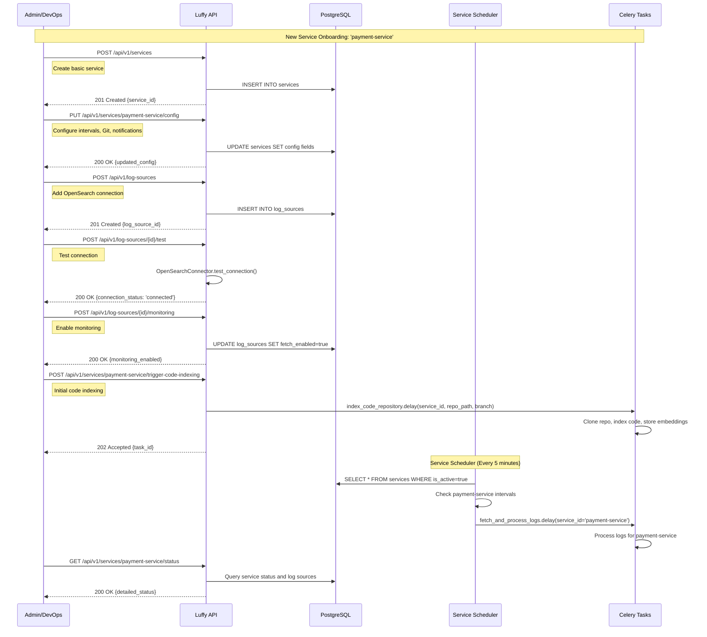
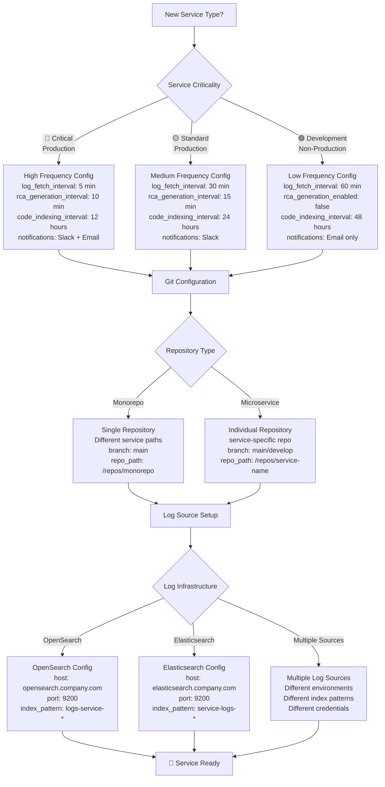
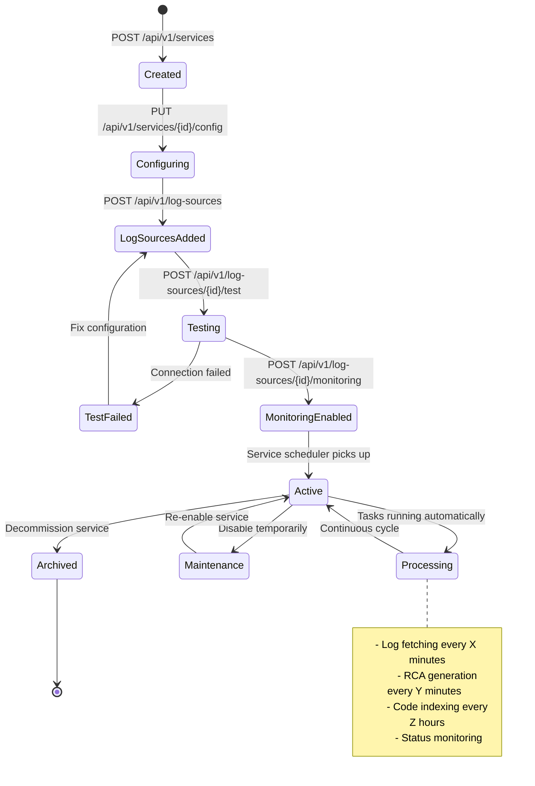
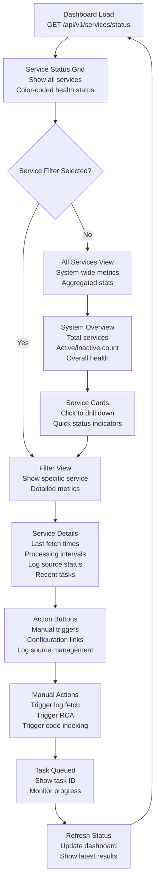

# End-to-End Service Flow Diagrams

## Overview

This document provides comprehensive flow diagrams for:
1. **Existing Service Processing Flow** - How configured services are processed continuously
2. **New Service Onboarding Flow** - How to add and configure new services

---

## 🔄 **1. EXISTING SERVICE PROCESSING FLOW**

### **Master Scheduler Flow (Every 5 Minutes)**

```mermaid
graph TD
    A[Master Scheduler Task<br/>schedule_service_tasks<br/>⏰ Every 5 minutes] --> B[Query Active Services<br/>SELECT * FROM services<br/>WHERE is_active = true]
    
    B --> C{For Each Service}
    
    C --> D[Check Log Fetch Due?<br/>current_time - last_log_fetch<br/>>= log_fetch_interval_minutes]
    
    C --> E[Check RCA Due?<br/>current_time - last_rca_generation<br/>>= rca_generation_interval_minutes]
    
    C --> F[Check Code Indexing Due?<br/>current_time - last_code_indexing<br/>>= code_indexing_interval_hours]
    
    D --> G{Log Fetch Due?}
    G -->|Yes| H[Schedule Log Fetch Task<br/>fetch_and_process_logs.delay<br/>service_id=X]
    G -->|No| I[Skip Log Fetch]
    
    E --> J{RCA Due?}
    J -->|Yes| K[Schedule RCA Task<br/>generate_rca_for_clusters.delay<br/>service_id=X]
    J -->|No| L[Skip RCA]
    
    F --> M{Code Indexing Due?}
    M -->|Yes| N[Schedule Code Indexing<br/>index_code_repository.delay<br/>service_id=X, repo_path, branch]
    M -->|No| O[Skip Code Indexing]
    
    H --> P[Update Service Status<br/>last_log_fetch = now()]
    K --> Q[Update Service Status<br/>last_rca_generation = now()]
    N --> R[Update Service Status<br/>last_code_indexing = now()]
    
    P --> S[Continue to Next Service]
    Q --> S
    R --> S
    I --> S
    L --> S
    O --> S
    
    S --> T{More Services?}
    T -->|Yes| C
    T -->|No| U[Scheduler Complete<br/>Wait 5 minutes]
    U --> A
```

### **Service-Specific Log Processing Flow**

```mermaid
graph TD
    A[Log Fetch Task Triggered<br/>fetch_and_process_logs<br/>service_id=web-app] --> B[Query Log Sources<br/>SELECT * FROM log_sources<br/>WHERE service_id = 'web-app'<br/>AND is_active = true<br/>AND fetch_enabled = true]
    
    B --> C{For Each Log Source}
    
    C --> D[Create OpenSearch Connector<br/>host = log_source.host<br/>port = log_source.port<br/>credentials = log_source.username/password]
    
    D --> E[Fetch Logs<br/>index_pattern = log_source.index_pattern<br/>query_filter = log_source.query_filter<br/>duration = 24 hours]
    
    E --> F[Process Logs<br/>LogProcessor.process_batch<br/>service_context = service_id]
    
    F --> G[Extract Exceptions<br/>Parse stack traces<br/>Identify error patterns]
    
    G --> H[Cluster Exceptions<br/>ExceptionClusterer.cluster<br/>Group similar exceptions<br/>service_id context]
    
    H --> I[Store in Database<br/>exception_clusters table<br/>service_id = 'web-app'<br/>log_source_id = X]
    
    I --> J[Update Log Source Status<br/>last_fetch_at = now()<br/>connection_status = 'connected']
    
    J --> K{More Log Sources?}
    K -->|Yes| C
    K -->|No| L[Update Service Status<br/>last_log_fetch = now()]
    
    L --> M[Task Complete<br/>Return processing stats]
```

### **Service-Specific RCA Generation Flow**

```mermaid
graph TD
    A[RCA Task Triggered<br/>generate_rca_for_clusters<br/>service_id=api-service] --> B[Query Service Clusters<br/>SELECT * FROM exception_clusters<br/>WHERE service_id = 'api-service'<br/>AND status = 'active'<br/>AND rca_status IS NULL]
    
    B --> C{For Each Cluster}
    
    C --> D[Check RCA Criteria<br/>cluster_count >= threshold<br/>time_since_first >= min_age<br/>severity >= min_severity]
    
    D --> E{Should Generate RCA?}
    E -->|Yes| F[Fetch Cluster Details<br/>Stack traces<br/>Exception patterns<br/>Recent occurrences]
    
    F --> G[Get Code Context<br/>Git blame analysis<br/>Recent commits<br/>File changes]
    
    G --> H[Generate RCA<br/>LLMAnalyzer.analyze_cluster<br/>Include service context<br/>Git information]
    
    H --> I[Store RCA Result<br/>rca_results table<br/>cluster_id, analysis, recommendations]
    
    I --> J[Send Notification<br/>Use service.notification_webhook_url<br/>OR service.notification_email<br/>IF service.notification_enabled]
    
    J --> K[Update Cluster Status<br/>rca_status = 'completed'<br/>rca_generated_at = now()]
    
    E -->|No| L[Skip Cluster<br/>Log reason]
    
    K --> M{More Clusters?}
    L --> M
    M -->|Yes| C
    M -->|No| N[Update Service Status<br/>last_rca_generation = now()]
    
    N --> O[Task Complete<br/>Return RCA stats]
```

### **Service-Specific Code Indexing Flow**

```mermaid
graph TD
    A[Code Indexing Task<br/>index_code_repository<br/>service_id=mobile-app<br/>repo_path=/repos/mobile<br/>branch=develop] --> B[Check Repository<br/>Validate repo_path exists<br/>Check Git repository status]
    
    B --> C[Git Operations<br/>git fetch origin<br/>git checkout service.git_branch<br/>git pull origin service.git_branch]
    
    C --> D[Scan Repository<br/>Find source files<br/>(.py, .js, .java, .kt, etc.)<br/>Skip node_modules, .git, etc.]
    
    D --> E[Incremental Check<br/>Compare with last_code_indexing<br/>Get changed files since last run<br/>git diff --name-only]
    
    E --> F{Files Changed?}
    F -->|Yes| G[Parse Source Files<br/>Extract functions, classes<br/>Generate code embeddings<br/>Store in vector database]
    
    F -->|No| H[Skip Indexing<br/>No changes detected]
    
    G --> I[Update Git Metadata<br/>Store recent commits<br/>Track code changes<br/>Link to service_id]
    
    I --> J[Update Service Status<br/>last_code_indexing = now()<br/>commit_sha = latest_commit]
    
    H --> J
    J --> K[Task Complete<br/>Return indexing stats]
```

---

## 🚀 **2. NEW SERVICE ONBOARDING FLOW**

### **Complete Service Onboarding Process**

```mermaid
graph TD
    A[🎯 New Service Onboarding<br/>Team wants to add 'payment-service'] --> B[Step 1: Create Service<br/>POST /api/v1/services<br/>Basic service information]
    
    B --> C[Step 2: Configure Service<br/>PUT /api/v1/services/payment-service/config<br/>Set processing intervals<br/>Git repository details<br/>Notification settings]
    
    C --> D[Step 3: Add Log Sources<br/>POST /api/v1/log-sources<br/>OpenSearch/Elasticsearch connections<br/>Index patterns and filters]
    
    D --> E[Step 4: Test Connections<br/>POST /api/v1/log-sources/{id}/test<br/>Verify connectivity<br/>Validate credentials]
    
    E --> F{Connection Test}
    F -->|✅ Success| G[Step 5: Enable Monitoring<br/>POST /api/v1/log-sources/{id}/monitoring<br/>enable = true]
    F -->|❌ Failed| H[Fix Connection Issues<br/>Update credentials<br/>Check network access<br/>Verify index patterns]
    
    H --> E
    
    G --> I[Step 6: Setup Git Repository<br/>Clone repository locally<br/>Set up git_repo_path<br/>Configure branch tracking]
    
    I --> J[Step 7: Initial Code Indexing<br/>POST /api/v1/services/payment-service/trigger-code-indexing<br/>Manual trigger for first run]
    
    J --> K[Step 8: Verify Service Status<br/>GET /api/v1/services/payment-service/status<br/>Check all components working]
    
    K --> L{Service Ready?}
    L -->|✅ Yes| M[🎉 Service Onboarded<br/>Automatic processing begins<br/>Monitor via dashboard]
    L -->|❌ No| N[Debug Issues<br/>Check logs<br/>Verify configuration<br/>Test individual components]
    
    N --> K
```

### **Detailed API Call Flow for Onboarding**



### **Service Configuration Decision Tree**



---

## 📊 **3. SERVICE LIFECYCLE STATES**

### **Service State Diagram**



---

## 🔧 **4. TROUBLESHOOTING FLOWS**

### **Service Health Check Flow**

```mermaid
graph TD
    A[Service Health Check<br/>GET /api/v1/services/{id}/status] --> B{Service Active?}
    
    B -->|❌ No| C[Service Inactive<br/>Check is_active flag<br/>Enable if needed]
    
    B -->|✅ Yes| D{Log Sources Connected?}
    
    D -->|❌ No| E[Connection Issues<br/>Test log source connections<br/>Check credentials/network<br/>Verify index patterns]
    
    D -->|✅ Yes| F{Recent Log Fetch?}
    
    F -->|❌ No| G[Fetch Issues<br/>Check fetch_enabled flags<br/>Verify intervals<br/>Check task queue]
    
    F -->|✅ Yes| H{RCA Generation Working?}
    
    H -->|❌ No| I[RCA Issues<br/>Check rca_generation_enabled<br/>Verify LLM configuration<br/>Check cluster criteria]
    
    H -->|✅ Yes| J{Code Indexing Working?}
    
    J -->|❌ No| K[Indexing Issues<br/>Check repository access<br/>Verify git_repo_path<br/>Check branch exists]
    
    J -->|✅ Yes| L[✅ Service Healthy<br/>All components working<br/>Monitor normally]
    
    C --> M[Fix and Retry]
    E --> M
    G --> M
    I --> M
    K --> M
    M --> A
```

---

## 📈 **5. MONITORING DASHBOARD FLOW**

### **Real-Time Service Monitoring**



---

## 🎯 **Summary**

### **Existing Service Processing:**
- **Automated**: Master scheduler runs every 5 minutes
- **Service-Aware**: Each service processed with individual configuration
- **Parallel**: Multiple services can process simultaneously
- **Resilient**: Failures in one service don't affect others

### **New Service Onboarding:**
- **8-Step Process**: From creation to full operation
- **API-Driven**: All configuration via REST APIs
- **Validation**: Connection testing and health checks
- **Flexible**: Supports different service types and configurations

### **Key Benefits:**
- **Scalability**: Add unlimited services with individual configs
- **Reliability**: Independent processing per service
- **Flexibility**: Different intervals and settings per service
- **Monitoring**: Real-time status and health checking
- **Automation**: Minimal manual intervention after setup

**Result: Complete end-to-end flows for both existing service processing and new service onboarding with comprehensive monitoring and troubleshooting capabilities.**
